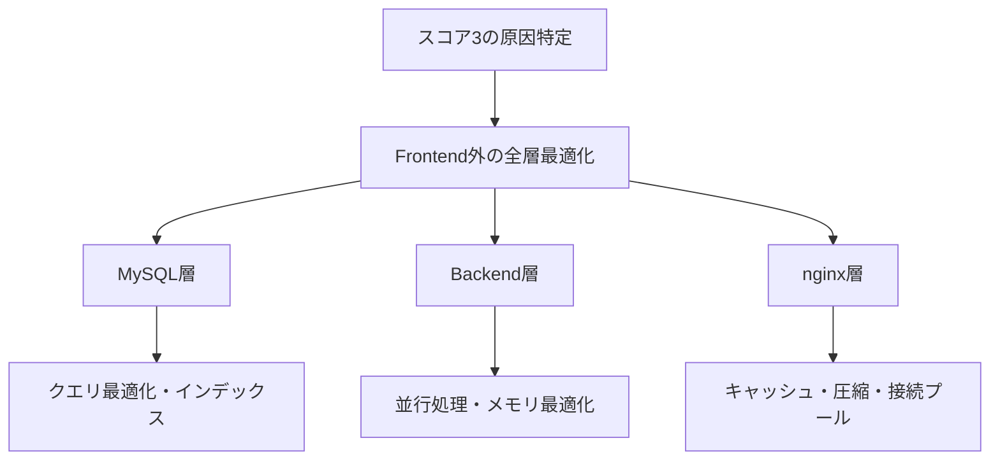

# mkawanoメモ

## 初期セットアップ
- `./init.sh` でリポジトリの初期化
- VM環境: `./init.sh`
- ローカル環境: `./init.sh [VMのパブリックIP] [秘密鍵のパス]`

1. 重複実行防止: .da/.initLockファイルで1回のみ実行可能
2. 環境判定: ホスト名でVM環境かローカル環境かを判別
   - VM環境（ftt2508-*）: データを直接コピー
   - ローカル環境: VM IPアドレスと秘密鍵を引数で指定
3. データダウンロード: GitHubリリースから初期データ（restoreSQL.zip）をダウンロード
4. Azure Container Registry: Dockerトークンでログイン
5. データベース復元: restore_and_migration.shを実行
6. 成功時: ロックファイル作成、Webアクセス先とテスト実行方法を表示

### `restore_and_migration.sh`
1. コンテナ再起動: restart_container.shを実行
2. DB再作成: 42tokyo2508-dbデータベースを削除・再作成
3. 初期化: init.sqlを実行
4. データリストア: 環境・引数に応じてSQLファイルを選択
   - 引数あり（e2e）: e2e_users.sql, e2e_products.sql + 指定ファイル
   - VM環境: remote_all.sql
   - ローカル環境: local_all.sql
5. マイグレーション: mysql/migration/内の0_*.sql, 1_*.sql...を順次実行

## 全体像

## 調査・分析
Jaegerトレーシング
- OpenTelemetryでリクエスト全体をトレース
- ボトルネック箇所の特定と処理時間計測
- 改善前後の比較による効果検証

段階的最適化
1. 測定によるボトルネック特定
2. 単一最適化の実装
3. 効果検証
4. 次のボトルネック特定

技術的考慮点
- E2Eテスト対応
  - 貪欲法では最適解が保証されずテスト失敗
  - DPアルゴリズムで最適解を保証してテスト通過

スケーラビリティ
- インデックスによりデータ増加に対応
- DBレベルページングで大量データ処理
- DP法で注文数増加にも効率的対応

この改善により、実用的な処理速度と正確性を両立した配送計画システムを実現

